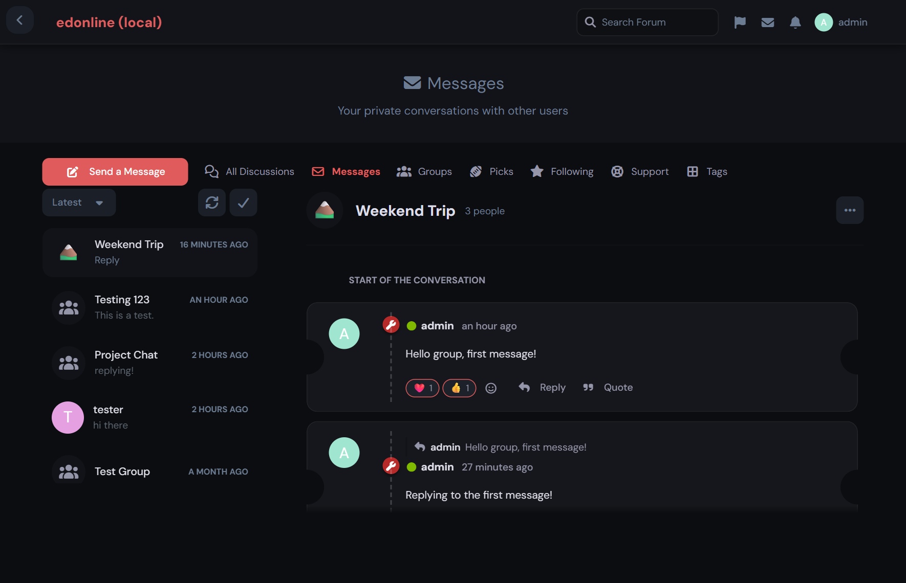
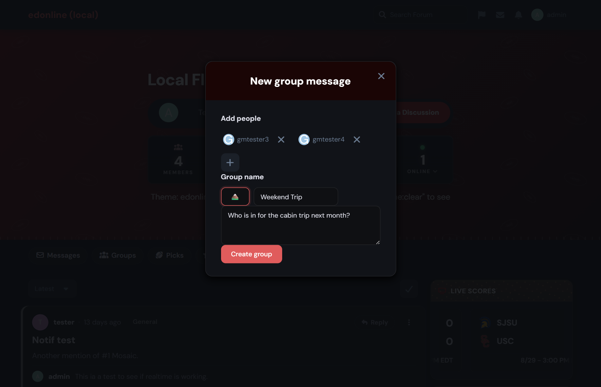
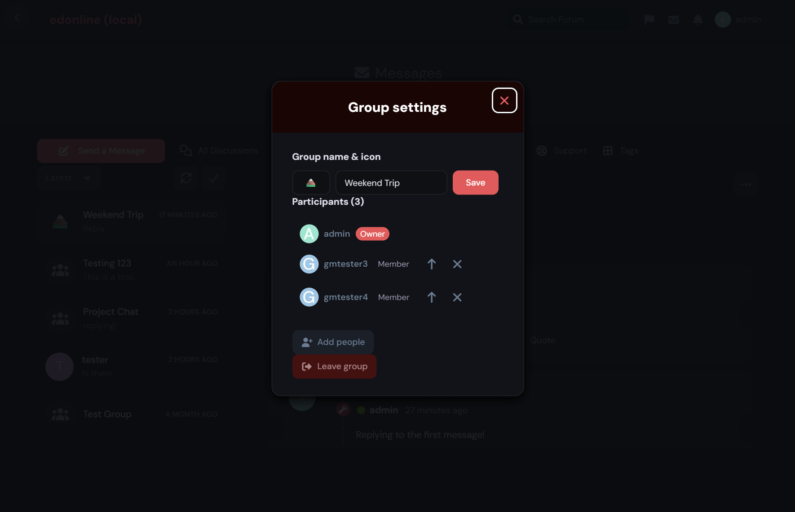

# Group Messages

[](LICENSE.md)
[](https://packagist.org/packages/ernestdefoe/group-messages)

A [Flarum](https://flarum.org) extension that turns private messages into **group conversations**. It builds on [`flarum/messages`](https://github.com/flarum/messages) — adding extra people, a name and icon, roles, participant management, read receipts, reactions, replies and quoting — without changing how one-on-one direct messages work.

## Features

- **Group conversations** — start a conversation with two or more other people, give it a name and an emoji icon.
- **Participant management** — add or remove people, leave a group, and (for the owner) promote or demote moderators.
- **Roles** — every group has an owner and optional moderators; everyone else is a member. Controls are shown based on your role.
- **Reactions** — react to any message with an emoji; reactions are grouped with counts.
- **Reply** — reply to a specific message, with a "replying to" indicator in the composer and an inline reference on the sent message.
- **Quote** — drop a markdown blockquote of any message into the composer.
- **Read receipts** — see small avatars of the participants who have read the latest message.

Direct (1-on-1) messages are left completely untouched.

## Screenshots

A group conversation — custom name and icon, participant count, message reactions, replies with an inline reference, and per-message actions:



Starting a new group — pick people, give it a name and an emoji icon, write the first message:



Managing a group — rename and re-icon, add or remove people, promote or demote moderators, or leave:



## Installation

```sh
composer require ernestdefoe/group-messages
```

This extension requires [`flarum/messages`](https://github.com/flarum/messages) to be installed and enabled.

## Updating

```sh
composer update ernestdefoe/group-messages
php flarum migrate
php flarum cache:clear
```

## Usage

- Open the **messages** dropdown (envelope icon) and choose **"New group message"** to start a group.
- Inside a group, use the **"…"** menu → **Group settings** to rename it, change its icon, add or remove people, manage moderators, or leave.
- Under each message you'll find the reaction picker, **Reply** and **Quote** actions.

### Permissions

Creating and using groups reuses the existing direct-message permission (`flarum/messages`' "send private messages"). No new permission is added — anyone who can send a DM can start a group.

## Development

```sh
cd js
npm install
npm run build      # or: npm run dev
```

After changing PHP or rebuilding JS on a site:

```sh
php flarum assets:publish
php flarum cache:clear
```

## Links

- [Packagist](https://packagist.org/packages/ernestdefoe/group-messages)
- [GitHub](https://github.com/ernestdefoe/group-messages)
- [Report an issue](https://github.com/ernestdefoe/group-messages/issues)

## License

This extension is licensed under the [MIT License](LICENSE.md).
